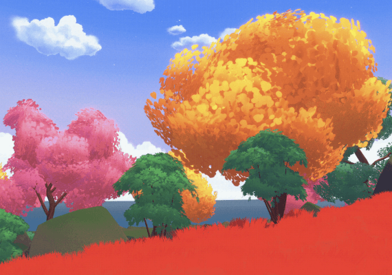

# Snake Cluster



**Snake Cluster** is a real-time multiplayer snake arena for Decentraland. Guide a colorful snake through the sand, collect energy, grow longer, unlock cosmetics, and outlast the other snakes to claim the crown.

The scene is an SDK7, four-parcel Decentraland experience with server-authoritative movement, food collection, collisions, scoring, and death handling.

## How to play

1. Choose a skin and press **Play**.
2. Collect the glowing energy around the arena to grow.
3. Stay clear of the arena walls and every snake body—including your own.
4. Cut in front of rivals to eliminate them, then collect their dropped energy.
5. Survive, grow, and become the longest living snake to wear the crown.

### Controls

| Platform | Steer | Boost |
| --- | --- | --- |
| Desktop | Hold left click and drag, or use `A` / `D` or the arrow keys | Hold `F`, `W`, or `Shift` |
| Mobile | Use the left joystick | Hold the on-screen boost button |

The snake never stops moving. Boosting consumes length, so it is most useful for escapes, interceptions, and decisive turns.

## Rules and mechanics

- **Energy field:** The server maintains 60 randomly positioned energy items, with spacing so the arena stays readable.
- **Growth:** Every collected item adds energy and length. All standard energy is safe to eat.
- **Boost:** Boosting makes the snake faster while gradually spending its length. A snake cannot boost once it is too short.
- **Collisions:** Touching a wall, your own body, or another snake’s body ends the run. Collision checks use swept head/body capsules, so a fast move cannot pass through a body between simulation frames.
- **Death drops:** A defeated snake becomes a trail of collectible energy. Drops stay available for **45 seconds** before expiring.
- **Crown and leaderboard:** The crown follows the longest currently living snake. The in-game leaderboard shows the current match and all-time best scores.
- **Cosmetics:** Pick from snake skins, find chests to unlock hats, and equip owned cosmetics from the collection menu.

## Multiplayer and smooth presentation

The game is authoritative by design:

- The multiplayer server owns snake movement, boosts, food positions, pickups, collisions, deaths, and score records.
- Clients send steering and boost intent only; they cannot teleport, award themselves food, or decide a death.
- Confirmed server poses are buffered and interpolated, then passed through a presentation-only visual follower. This keeps movement and the camera smooth through ordinary packet jitter without predicting gameplay or weakening collision authority.
- Server snapshots and retained CRDT state allow players joining late to see the current arena, food, snakes, and leaderboard.

## Audio and UI

- Background music, eating sounds, defeat cues, and enemy-death feedback can be toggled in the menu.
- Every interactive menu button and selectable owned cosmetic plays the official Decentraland UI click sound.
- The UI includes responsive desktop and mobile layouts, a concise How to Play guide, collection screens, scoreboards, and audio settings.

## Run locally

### Creator Hub (recommended)

1. Install the [Decentraland Creator Hub](https://decentraland.org/download/creator-hub).
2. Import this repository folder from the **Scenes** tab.
3. Choose **Preview** to run the arena locally.

### Command line

```bash
npm ci
npm run start
```

Build a production bundle with:

```bash
npm run build
```

## Tests

The project has focused regression coverage for authoritative movement, packet jitter, food claims, collisions, death ordering, UI layout, and the 45-second death-drop lifetime.

```bash
node scripts/test-netcode.cjs
node scripts/test-server-food.cjs
node scripts/test-snake-game.cjs
npm run build
```

GitHub Actions runs the reproducible Node 24 build with `npm ci` on pushes and pull requests.

## Project map

| Path | Purpose |
| --- | --- |
| `src/snake-game.ts` | Client-side gameplay presentation, controls, UI state, audio, and cosmetic rendering |
| `src/multiplayer-server.ts` | Authoritative simulation, pickups, collisions, deaths, and score persistence |
| `src/netcode.ts` | Movement integration, snapshot interpolation, and network timing |
| `src/ui.tsx` | Responsive in-game menus, tutorial, collection, HUD, and leaderboard |
| `assets/` | Arena content, models, textures, UI art, and audio |
| `assets/scene/main.composite` | Static Creator Hub scene content |

## Deployment

The scene is configured as an authoritative multiplayer World named `bibi.dcl.eth`. To deploy through the command line, use:

```bash
npm run deploy
```

Use a wallet/account with permission to deploy to the target World. Creator Hub can also handle previewing and publishing.
